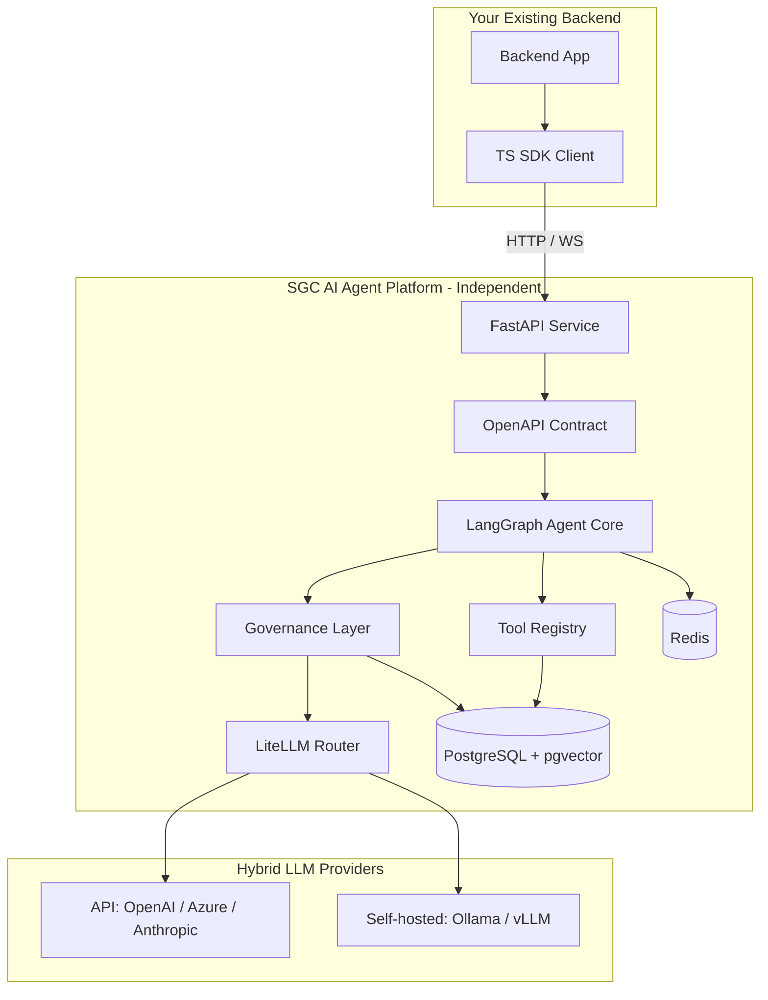
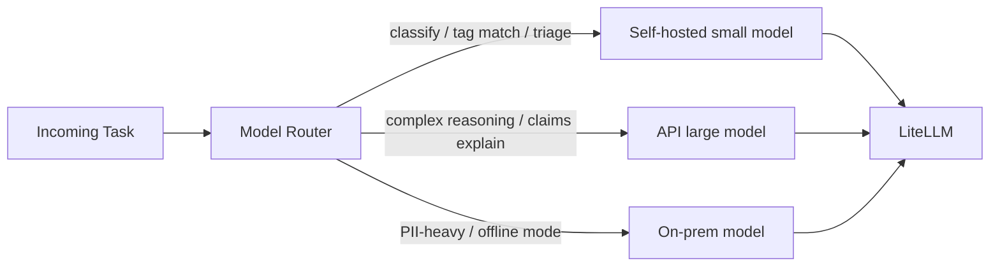
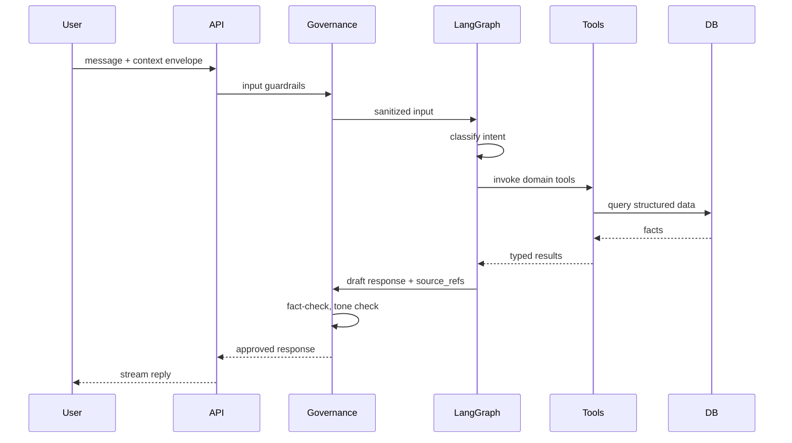

# Smart Garage Customer AI Agent — Tech Stack & Implementation Plan

## Recommended Tech Stack

| Layer | Choice | Why |
|-------|--------|-----|
| **Agent core** | Python 3.12 + **LangGraph** | Best-in-class agent orchestration, stateful flows (RSA triage, claims), tool calling, human-in-the-loop |
| **LLM abstraction** | **LiteLLM** | Single interface for OpenAI, Azure OpenAI, Anthropic, Groq, and self-hosted (Ollama, vLLM, llama.cpp) |
| **Self-hosted LLMs** | **Ollama** (dev/small) + **vLLM** (prod GPU) | Hybrid routing: cheap/local for classification & triage; API models for complex reasoning |
| **Agent DB** | **PostgreSQL 16** + **pgvector** | Relational schemas from your doc + vector search for symptom/tags/RAG; one DB to operate |
| **ORM / migrations** | **SQLAlchemy 2** + **Alembic** | Typed models, versioned schema evolution |
| **API service** | **FastAPI** | Async, OpenAPI-first, WebSocket for streaming chat |
| **TS SDK / wrapper** | **TypeScript** package (`@sgc/agent-sdk`) | Typed client for your separate backend; zero Python dependency on consumer side |
| **Cache / sessions** | **Redis** | Conversation state, rate limits, governance audit buffer |
| **Observability** | **OpenTelemetry** + structured logs | Traces per turn: model, tools, governance decisions |
| **Validation** | **Pydantic v2** | Tool inputs/outputs, API contracts, structured LLM responses |

---

## High-Level Architecture



**Backend independence contract:** Your backend passes only **context envelopes** (customer ID, vehicle ID, session ID, optional location). The agent never reads your backend DB directly. All garage intelligence lives in the agent DB, synced via **webhooks, batch ETL, or admin import tools** — not tight coupling.

---

## Plug-and-Play Integration Model

### 1. Standalone service (primary)
- Deploy `agent-api` as its own container/service.
- Endpoints:
  - `POST /v1/sessions` — start conversation
  - `POST /v1/chat` — message (sync)
  - `WS /v1/chat/stream` — streaming
  - `POST /v1/tools/invoke` — direct tool call (for backend automation)
  - `GET /health`, `GET /v1/models` — ops

### 2. TypeScript SDK (consumer side)
```typescript
import { SgcAgentClient } from "@sgc/agent-sdk";

const agent = new SgcAgentClient({ baseUrl, apiKey });
const reply = await agent.chat({
  sessionId,
  message: "Do you have brake pads for 2018 Swift?",
  context: { customerId, vehicleId, locale: "en-IN" },
});
```

SDK is a **thin HTTP/WebSocket wrapper** — no agent logic duplicated in TS.

### 3. Integration adapter pattern (future-proof)
Define a `BackendAdapter` interface in Python for optional callbacks (e.g., create booking in your backend). Default: **no-op stub**. Your backend registers webhooks when ready. Agent works fully standalone without them.

---

## Anti-Hallucination Strategy (Tool-First, Not Prompt-Only)

Hallucinations are reduced by **architecture**, not just instructions:

1. **Grounded response policy** — Agent MUST call a domain tool before stating prices, part availability, claim liability, or garage recommendations. If tool returns empty → scripted fallback: *"I don't have that information yet; let me connect you with our team."*
2. **Structured tool outputs** — Tools return typed JSON (Pydantic). LLM renders human text from facts, not free invention.
3. **Citation metadata** — Every factual answer includes internal `source_refs` (table + record IDs) stored in audit log; optional display to customer.
4. **Deterministic calculators** — Cost, claim liability, garage scoring run in **Python services**, not LLM math.
5. **Confidence gates** — Symptom/triage matching below threshold → clarifying question from `Symptom_Mapping.AI_Diagnostic_Question`, not a diagnosis.
6. **Response validator (governance)** — Post-generation check: numbers in reply must match tool output; block if mismatch.

---

## Customer Tone & Persona

Centralize in [`packages/agent-core/src/persona/`](packages/agent-core/src/persona/):

- **System prompt template** (versioned): respectful, friendly, Indian English, no jargon unless explained, safety-first for RSA/claims.
- **Tone rules in governance**: block aggressive upselling language, profanity, medical/legal overreach.
- **Escalation templates** for sensitive flows (insurance rejection, safety-critical brakes).
- **Locale pack** (`en-IN` first; structure for Hindi later).

Persona is **config, not hardcoded** — loaded from DB/config so you can A/B test without redeploying models.

---

## Multi-Model Hybrid Routing



**Routing rules (config-driven):**

| Use case | Default model tier | Fallback |
|----------|-------------------|----------|
| Intent classification, symptom tagging | Self-hosted (Llama 3.1 8B / Mistral) | API mini model |
| Parts lookup, pricing quotes | Tool-only + small model for NLG | — |
| Claims liability explanation | API strong model | Self-hosted 70B if available |
| RSA emergency triage | Fast self-hosted + rule engine | API if ambiguous |

Implement `ModelRouter` with: task type, latency budget, cost budget, data residency flag, and provider health checks.

---

## AI Governance Layer

Governance wraps **every** LLM call and **every** outbound message.

| Capability | Purpose |
|------------|---------|
| **Policy engine** | YAML/DB rules: what tools allowed per session type, PII handling, claim advice limits |
| **Prompt registry** | Versioned prompts with rollback; tied to audit logs |
| **Input guardrails** | Injection detection, off-topic blocking, profanity |
| **Output guardrails** | Fact-check vs tool results, price bounds, no fabricated policy numbers |
| **PII redaction** | Mask Aadhaar, phone, policy numbers in logs; tokenize in prompts where possible |
| **Audit trail** | `governance_events`: session_id, model, prompt_version, tools_called, decision, latency |
| **Human-in-the-loop** | RSA High severity, claim rejection → flag for advisor review before auto-SMS |
| **Rate limiting & quotas** | Per customer, per garage, per API key |
| **Model allowlist** | Only approved models in prod |

Governance runs **before** LLM (input) and **after** LLM (output), never skipped.

---

## Database Design (Agent-Owned PostgreSQL)

Organize into **domain schemas** matching your use cases. Use normalized tables + JSONB only where arrays/tags are needed.

### Schema namespaces

```
agent_meta     — sessions, messages, audit, prompt_versions
catalog        — parts, fitment, services, pricing
operations     — quick service, express, RSA, claims
marketplace    — garage master, capabilities, scoring
diagnostics    — issues, symptoms, predictive matrix
governance     — policies, guardrail_events
sync           — import jobs, source mappings from backend
```

### Core entity groups (from [Ai assistant.md](Ai assistant.md))

**Catalog domain**
- `catalog.parts` — Part_ID, SKU, OEM/MPN, specs, inventory, pricing, search_tags, installation_notes
- `catalog.part_fitment` — many-to-many: part ↔ vehicle make/model/variant/fuel/years
- `catalog.part_interchanges` — substitute parts (normalized, not CSV)
- `catalog.vehicle_segments` — segment, body_type, fuel, oil_capacity
- `catalog.service_packages` — Basic/Standard/Comprehensive
- `catalog.service_inclusions` — package ↔ inclusion matrix
- `catalog.pricing_matrix` — package × segment → labour + consumables + duration
- `catalog.add_on_repairs` — symptom_tags, segment costs, safety_critical
- `catalog.quick_services` + `catalog.quick_service_pricing`
- `catalog.service_master`, `catalog.labor_cost_matrix`, `catalog.service_parts_bom`, `catalog.parts_cost_master`, `catalog.auxiliary_charges`

**Operations domain**
- `operations.claims`, `operations.policy_rules`, `operations.claim_line_items`
- `operations.emergency_triage_rules`, `operations.emergency_requests`, `operations.field_resources`

**Marketplace domain**
- `marketplace.garages`, `marketplace.garage_capabilities`, `marketplace.garage_analytics`, `marketplace.garage_experience`

**Diagnostics domain**
- `diagnostics.vehicle_issues`, `diagnostics.predictive_failure_matrix`, `diagnostics.symptom_mapping`

**Agent meta**
- `agent_meta.conversations`, `agent_meta.messages`, `agent_meta.tool_invocations`
- `agent_meta.customer_context_cache` — snapshot of vehicle/customer context from backend envelope (not source of truth)

**Search enhancement**
- `pgvector` embeddings on: `search_tags`, `symptom_tags`, `customer_keywords`, `part_name` — hybrid search (BM25 via PostgreSQL FTS + vector).

### Indexing priorities
- GIN on `search_tags`, `symptom_tags` (array/jsonb)
- Composite indexes: `(vehicle_make, vehicle_model, fuel_type)` on fitment
- FTS + vector hybrid for NL queries like *"chimta for Swift"*

---

## Tool Registry (Agent Capabilities)

Tools are the public API the LLM uses. Group by domain:

| Tool | Reads / Writes | Use case |
|------|----------------|----------|
| `search_parts` | catalog | Spare parts NL + OEM lookup |
| `check_part_fitment` | catalog | "Will this fit my car?" |
| `suggest_alternates` | catalog | Interchange when out of stock |
| `compare_service_packages` | catalog | Basic vs Standard vs Comprehensive |
| `estimate_service_cost` | catalog (deterministic) | Package + vehicle → price |
| `estimate_repair_cost` | catalog | Symptom → add-on repair |
| `list_quick_services` | catalog | Express IN |
| `explain_claim_liability` | operations (deterministic) | Insurance customer bill |
| `get_claim_status` | operations | Workflow tracking |
| `triage_emergency` | operations + rules | RSA dispatch decision |
| `dispatch_resource` | operations | Nearest mechanic/tow |
| `recommend_garages` | marketplace (scoring algo) | Garage select |
| `diagnose_symptom` | diagnostics | Issues + predictive filter |
| `get_predictive_maintenance` | diagnostics | Proactive warnings |
| `create_session_note` | agent_meta | Escalation to human |

**Write tools** (guarded by governance): `log_emergency_request`, `create_claim_intimation_draft`, `record_customer_preference`. No direct inventory mutation in v1 unless explicitly approved.

Each tool: Pydantic input/output schema, idempotent where possible, logged in `agent_meta.tool_invocations`.

---

## Recommended Monorepo Folder Structure

```
sgc-ai-agent/
├── apps/
│   ├── agent-api/                 # FastAPI deployable service
│   │   ├── src/
│   │   │   ├── routes/            # chat, sessions, health, admin
│   │   │   ├── middleware/        # auth, rate limit, trace
│   │   │   └── main.py
│   │   ├── Dockerfile
│   │   └── pyproject.toml
│   └── admin-console/             # (Phase 3) prompt/policy/data import UI
│
├── packages/
│   ├── agent-core/                # LangGraph orchestration
│   │   ├── src/
│   │   │   ├── graphs/            # per-domain subgraphs (parts, claims, rsa...)
│   │   │   ├── nodes/             # classify, plan, tool_exec, respond
│   │   │   ├── state/             # AgentState typed dict
│   │   │   ├── persona/           # tone, templates, locale
│   │   │   └── router/            # intent → subgraph
│   │   └── pyproject.toml
│   │
│   ├── llm-providers/             # LiteLLM wrapper, ModelRouter, fallbacks
│   │   ├── src/
│   │   │   ├── router.py
│   │   │   ├── providers/         # ollama, openai, azure, vllm
│   │   │   └── config/
│   │   └── pyproject.toml
│   │
│   ├── tools/                     # Tool definitions + executors
│   │   ├── src/
│   │   │   ├── catalog/
│   │   │   ├── operations/
│   │   │   ├── marketplace/
│   │   │   ├── diagnostics/
│   │   │   └── registry.py
│   │   └── pyproject.toml
│   │
│   ├── governance/                # AI governance layer
│   │   ├── src/
│   │   │   ├── policies/
│   │   │   ├── guardrails/        # input, output, fact-check
│   │   │   ├── audit/
│   │   │   ├── pii/
│   │   │   └── prompt_registry/
│   │   └── pyproject.toml
│   │
│   ├── db/                        # SQLAlchemy models, repos, migrations
│   │   ├── alembic/
│   │   ├── src/
│   │   │   ├── models/            # catalog/, operations/, ...
│   │   │   ├── repositories/
│   │   │   └── seeds/             # sample garage data
│   │   └── pyproject.toml
│   │
│   ├── domain-services/           # Deterministic business logic (no LLM)
│   │   ├── src/
│   │   │   ├── pricing_calculator.py
│   │   │   ├── claim_liability_engine.py
│   │   │   ├── garage_scorer.py
│   │   │   └── triage_engine.py
│   │   └── pyproject.toml
│   │
│   └── shared/                    # Shared Python types, constants
│       └── pyproject.toml
│
├── sdks/
│   └── typescript/
│       ├── src/
│       │   ├── client.ts
│       │   ├── types/             # generated from OpenAPI
│       │   └── streaming.ts
│       ├── package.json
│       └── README.md
│
├── contracts/
│   ├── openapi/agent-api.yaml     # Source of truth for SDK generation
│   └── events/                    # Webhook payload schemas
│
├── infra/
│   ├── docker-compose.yml         # postgres, redis, ollama, agent-api
│   ├── k8s/                       # (later) prod manifests
│   └── terraform/                 # (later)
│
├── scripts/
│   ├── seed_db.py
│   ├── import_parts_csv.py
│   └── generate_sdk.sh
│
├── docs/
│   ├── architecture.md
│   ├── integration-guide.md
│   ├── governance-policies.md
│   └── data-model.md
│
├── tests/
│   ├── unit/
│   ├── integration/
│   └── evals/                     # LLM eval sets (hallucination, tone)
│
├── pyproject.toml                 # uv/poetry workspace root
├── package.json                   # turborepo optional for TS SDK
└── README.md
```

**Design principles embedded in this structure:**
- **Domain boundaries** — each use case maps to `graphs/` subgraph + `tools/` + `db/models/` + `domain-services/`
- **LLM replaceable** — all model calls go through `llm-providers/`
- **Governance mandatory** — imported by `agent-core`, not optional middleware
- **Backend agnostic** — `contracts/` + `sdks/` define the only coupling surface

---

## Agent Orchestration Flow



**Intent routing** to subgraphs: `parts`, `services_pricing`, `quick_service`, `claims`, `rsa`, `garage_match`, `diagnostics`, `general_faq`.

---

## Implementation Phases

### Phase 1 — Foundation (Weeks 1–3)
- Monorepo scaffold, Docker Compose (Postgres, Redis, Ollama)
- `db` package: core catalog schema (parts, fitment, segments, service packages, pricing matrix)
- `llm-providers`: LiteLLM router with 1 API + 1 self-hosted model
- `governance`: audit log, prompt registry v1, basic output fact-check
- `agent-api`: session + chat endpoints
- `typescript` SDK v0.1
- Seed data for one vehicle line (e.g., Swift + Creta)

### Phase 2 — Core use cases (Weeks 4–7)
- Tools: `search_parts`, `estimate_service_cost`, `compare_service_packages`, `diagnose_symptom`
- LangGraph subgraphs: parts, services/pricing, diagnostics
- Domain services: pricing calculator, garage scorer (stub)
- Hybrid routing rules for classify vs explain tasks
- Eval suite: hallucination tests (price/part must match DB)

### Phase 3 — Advanced operations (Weeks 8–11)
- Claims schema + `explain_claim_liability` deterministic engine
- RSA triage + emergency logging (dispatch integration via webhook adapter)
- Quick service / Express IN tools
- Garage marketplace scoring (full 100-point algorithm from your doc)
- WebSocket streaming + governance human-in-the-loop flags

### Phase 4 — Production hardening (Weeks 12+)
- Data sync pipeline from your backend (CSV/API importers in `scripts/`)
- Admin console for prompt/policy management
- OTel dashboards, model failover, cost tracking
- Hindi locale, expanded evals for tone/respectfulness

---

## Key Technical Decisions Summary

| Decision | Choice |
|----------|--------|
| Backend coupling | Contract-only (HTTP + context envelope); optional webhooks |
| Source of truth | Agent PostgreSQL; backend syncs in, never queried live |
| Hallucination control | Tool-first + deterministic calculators + output fact-check |
| Multi-model | LiteLLM + task-based ModelRouter |
| Tone | Versioned persona config + governance tone rules |
| Expansion | New use case = new subgraph + tools + models + seeds (no core rewrite) |

---

## Immediate Next Steps After Plan Approval

1. Initialize monorepo with `apps/agent-api` and `packages/{agent-core,db,governance,llm-providers,tools}`
2. Create Alembic migrations for `catalog` + `agent_meta` schemas
3. Implement FastAPI chat endpoint + TS SDK against OpenAPI contract
4. Build first subgraph: **parts lookup** end-to-end (proves plug-and-play + grounding)
5. Add governance audit trail from day one
